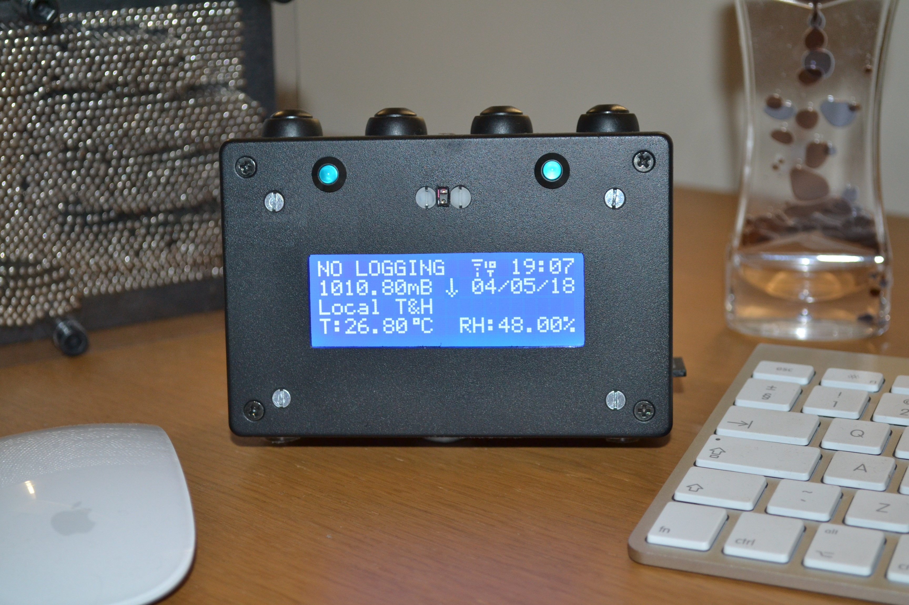
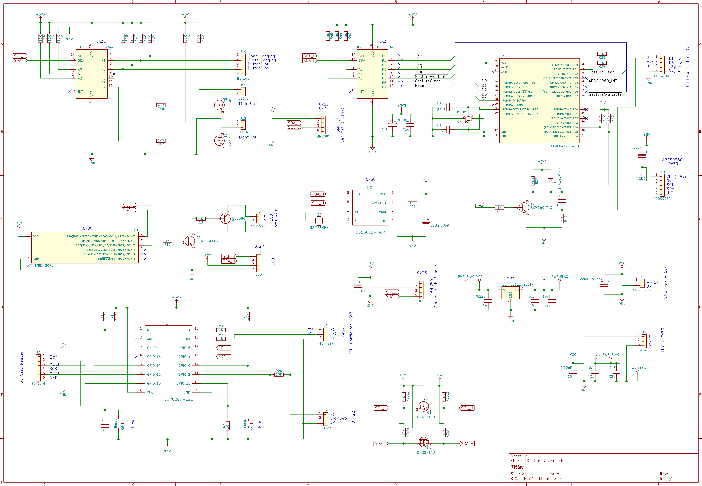

# IoT-Desktop-Device

IoT Desktop Device Using the ESP8266-12E

### The IoT Desktop Device

### Full circuit diagram

This repository holds the details on how to create an IoT Desktop Device and is part of a series on IoT and home automation [here](https://www.instructables.com/id/Home-Automation-12/).

By Steve Quinn

Written to support the following Instructable;

TBA

### Directory content

#### Tests

These are python based automated regression tests executed when there has been any code changes. The python script forms a test executive which uses an excel spreadsheet as it's input. Each work sheet is a single test made up of rows of executable actions.
When the test runs (by calling the doit.bat batch file) a time stamped log is displayed as execution proceeds. This log is also dumped to a text file.
Given time stamping is included, it is a useful tool to determine if there have been any dynamic changes in execution after a code change.

Note : This testing capability requires the use of the I2C LCD library I created as it allows the user to directly read both DD and CG ram in the LCD memory. This is how automation is achieved. As far as I am aware my library is the only I2C LCD library which exposes this functionality. [here](https://github.com/SteveQuinn1/LiquidCrystal_I2C_PCF8574) 

#### data

These files are to be copied to the SD card and are used by the system at start up to configure the device and serve up a web page if the device cannot connect to your home network for whatever reason. 

Configuration files
There are six text files named 'secvals.txt', 'calvals.txt', 'confvals.txt', 'consenin.txt', 'congesud.txt', 'conbutin.txt' 

secvals.txt : contains six entries used by the IoT device to connect to your home network. You will need to add your own ID and P/W here.

calvals.txt : Contains simple calibration data for the system humidity, temperature and barometric sensors.

confvals.txt : Contains configurable entries to control the automatic switching of the display back light depending upon ambient room lighing levels, scroll delay times etc.

consenin.txt : Contains configurable entries which enable the unit to subscribe to two topics Temp and Humidity and link these topics to a logical name (bedroom, kitchen, hall etc.)

congesud.txt : Contains configurable gesture entries which are matched to Up and Down gestures respectively. 

conbutin.txt : Contains configurable button entries which are matched to the two user programmable buttons. 

#### docs

This contains the images on the front page of the repository.

#### tools

This is the spread sheet I used to generate the special character icons used on the system LCD.

#### other

This contains a copy of the source code used by U1 (System backlight PWM controller using easing functions) and U3 (the nonblocking implementation of the APDS9960 library)

For U1 see [here](https://www.instructables.com/id/Smooth-PWM-LED-Fading-With-the-ATTiny85/)

For U3 see [here](https://www.instructables.com/id/NonBlocking-APDS9960-Gesture-Sensor-Implementation/)

Note : for the NonBlocking APDS9960 Arduino Library go to this repository [here](https://github.com/SteveQuinn1/APDS9960_NonBlocking)

If you are not familiar with programming the ATtiny85 and ATMega328P see the following instructable [here](https://www.instructables.com/id/Programming-the-ATTiny85-ATTiny84-and-ATMega328P-A/)

#### OpenHAB

These are the OpenHAB configuration files I used to integrate the IoT Desktop device into my home IoT network.